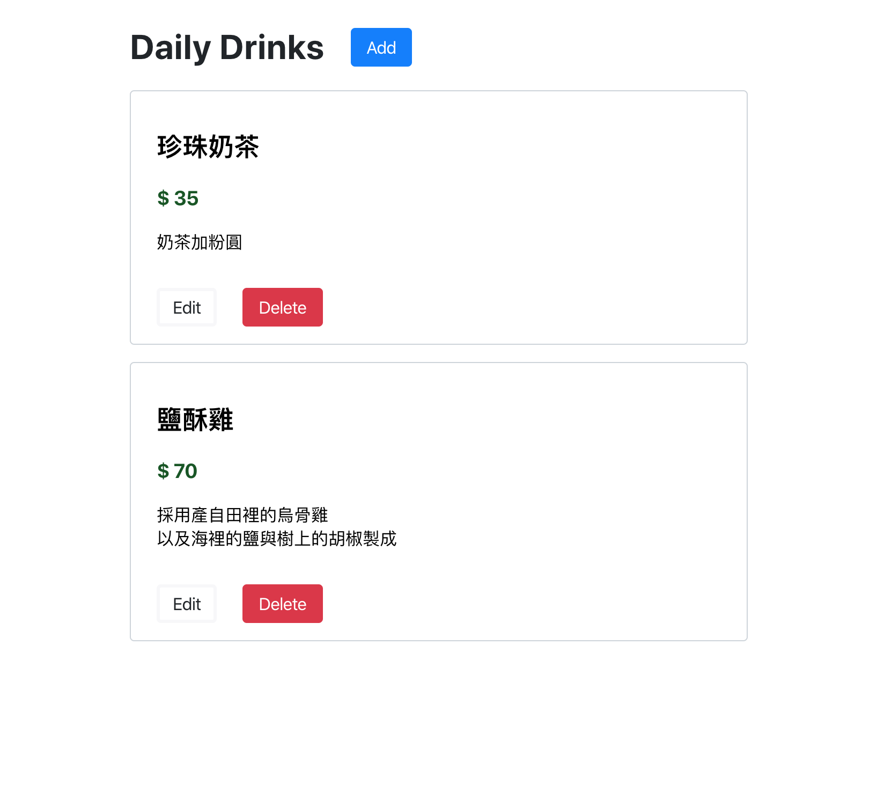

# Daily Drinks
Assignment to 17 Media
- Implenmented CRUD operations in App
- Implenmented unit tests for components and app
- Ensured RWD layout in both desktop and mobile environments

## Demo links
- [CodeSandbox](https://codesandbox.io/s/github/mxgit1090/dailydrinks)
- [Github Pages](https://mxgit1090.github.io/dailydrinks/)

## Used packages
- `create-react-app`: React boilerplate for this app
- `@testing-library`: For unit test
- `nanoid`: to generate unique ID to ease the list handling for update and remove
- `node-sass`: CSS preprocesser for variables, mixin, nest structure, etc
- `prop-types`: to validate React props

## Screen

